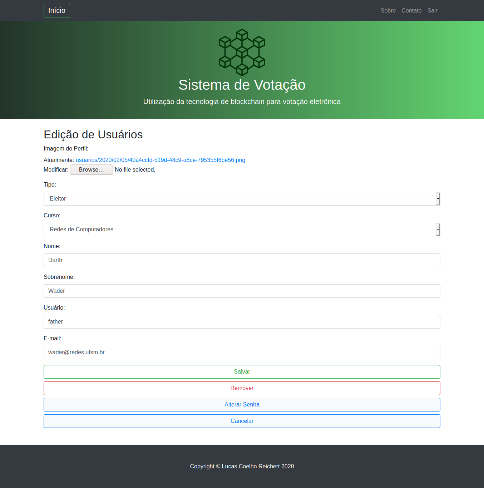

# BlockchainVoting

## Intalação do Ambiente Virtual (opcional)

pip intall virtualenv

virtualenv venv

source venv/bin/activate

## Configuração do Ambiente

sudo apt install python3.x

apt install python3-pip

pip3  install django==2.2.6

pip3 install pillow

# Algumas Telas do Sistema
## Desktop

## Mobile

